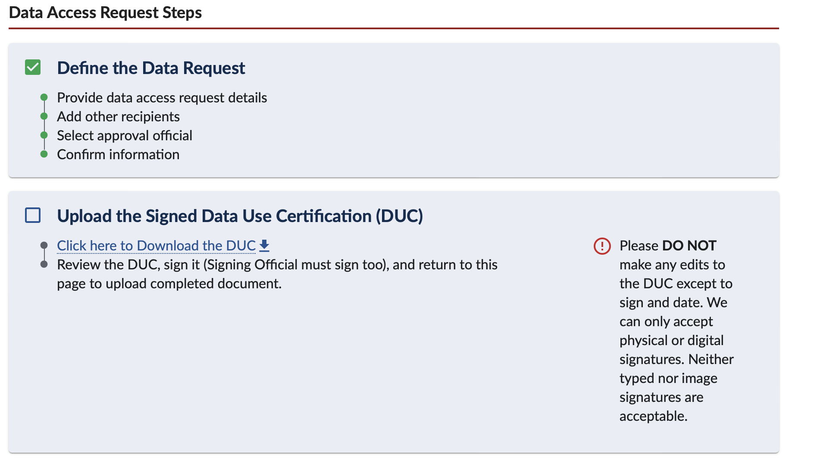
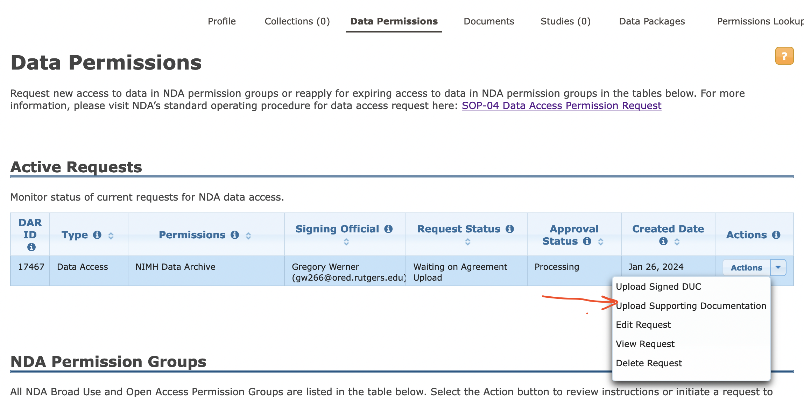

# Tutorial: Data from NDA

Date: February 15, 2024 12:02 PM

Database: [National Data Archive](https://nda.nih.gov/) at the United States National Institute of Health

Helpdesk Contact: [ndahelp@mail.nih.gov](mailto:ndahelp@mail.nih.gov) 

<aside>
✍️ Tutorial Contents:

</aside>

Youtube Tutorial: [https://www.youtube.com/watch?v=53P6hEy-zaM](https://www.youtube.com/watch?v=53P6hEy-zaM) 

## 1) Have an eRA Profile

1. Make sure you have an eRA account. If you don’t have one, email the RBHS signing official, Gregory Werhner ([gw266@research.rutgers.edu](mailto:gw266@research.rutgers.edu)) to have one created for you
2. Ask your PI what institution they’re assigned to as a PI in NDA. Then put in your employment, making sure to select the same institution as they have. 
    1. For example, there are 2 versions of RBHS. “Rutgers Biomedical and Health Sciences”, and “Rutgers Biomedical/Health Sciences - RBHS”. There’s also “Rutgers, the State University of NJ” and others. Make sure to select the one that matches your PI
3. Change your contact email to your Rutgers email 

## 1) Get Access to NDA

1. [Create an NDA account](https://nda.nih.gov/nda/tutorials/first_steps_of_data_submission?chapter=your-nda-account) ([nda tutorial](https://nda.nih.gov/nda/tutorials/first_steps_of_data_submission?chapter=your-nda-account)): Go to the NDA website: [https://nda.nih.gov/](https://nda.nih.gov/). To create an account, click the “log in” button in the top right which will prompt a few “create account” options. Make sure to link to your eRA or [login.gov](http://login.gov) which is listed with your institutional email
2. After/if you already have an account, go to “Profile” and make sure your institutional affiliation is the same as listed on your eRA account / your PI’s institutional affiliation.
    1. If it’s not, email the helpdesk [ndahelp@mail.nih.gov](mailto:ndahelp@mail.nih.gov) and ask it to be changed 

### 1.1) Be added to an existing DUC for the NDA dataset(s) you wish to use

1. Have the PI/primary requestor add your name to the existing DUC from the NDA website
2. Have the PI download the Data Access Request (DAR)
3. Follow steps 3-5 from **1B**

### 1.2) Request Access under a new DUC to the NDA dataset(s) you wish to use

If your PI doesn’t already have a Data Use Agreement (DUA) for the dataset you wish to use, you must request permissions.

1. First, make sure your PI’s ‘Institutional affiliation’ is the same as yours
2. Have your PI go to Profile > Data Permissions > scroll down to the collection… > Request Access (PI must start a request to the data collection that holds the dataset you’re interested in)
3. Fill project specific fields— example responses :
    1. **Name of Project: “**Psychiatric connectomes”
        1. Not important, doesn’t have to match anywhere else
    2. **Research purpose:** “Our research is looking at the relationship between biological biomarkers, such as MRI and fMRI, and behavioral markers such as clinical phenotypes and task-behavior. “
4. Fill in the other two fields— USE THIS LANGUAGE for these questions:
    
    **Data access plan**: “The data will be stored on a secure server, in a password protected partition on the Rutgers University Amarel computing cluster. The folder will only be accessible by those listed in this DUA.”
    
    **Plan for deletion**: “All data that has been downloaded from this dataset will be deleted from all our local or cloud-based machines when research is completed, or this DUC is expired, whichever comes first.“ 
    
5. Then add everyone who will access the data 
    1. If the person has an NDA account: but you don’t see them on the list of “Known affiliated user” you have to ask them to follow steps 1.a.-1.c.
        1. Make sure to select the email associated with your collaborator’s NDA account. Don’t press ‘add new user’ unless your collaborator doesn’t have an NDA account already
6. For “Signing Official”, select Chrissa Pappannoiu ****[cp847@ored.rutgers.edu](mailto:cp847@ored.rutgers.edu)
7. Download the DUC file (auto-created)
    1. E-sign it as the Lead Recipient
    
    
    
8. Email the signed file to **Gregory Werhner** [cp847@ored.rutgers.edu](mailto:cp847@ored.rutgers.edu)
    1. Message: “Hi Chrissa, 
    I’m a researcher in the Holmes Lab and we’re applying for access to the NDA dataset [Enter dataset name] for the purposes of scientific investigation. The data will be stored on a secure server, in a password protected file on the Rutgers University Amarel computing cluster. The folder will only be accessible by those listed in this DUA. All raw data will be deleted after the conclusion of the project.”
9. Once you receive it back signed, upload the DUC (signed by both of you) to the “Upload Supporting Documentation” under “active requests”
    
    
    
10. Wait to get granted access

### 1C) Get added to your PI’s existing collection/dataset

For PI/Administrators: How to Add Users to Your NDA Collection

---

1. Have the user [create an NDA account](https://nda.nih.gov/nda/tutorials/first_steps_of_data_submission?chapter=your-nda-account).
2. Click on the Permissions tab on your NDA Collection.
    
    
    
3. Enter either the NDA username or email address of the person you wish to add.
    
    
    
4. Click on search.
    
    
    
5. Click on Add User.
    
    
    
6. Apply the [desired permission level](https://nda.nih.gov/nda/tutorials/first_steps_of_data_submission?chapter=collection-permissions#permission-levels).
    
    
    
7. Click Save on the bottom left of the screen.
    
    
    

<aside>
🌟 For more information, please see:

PDF Tutorial: [https://rutgers.box.com/s/fh8iv3luan3xonevzyijf185shpzavvm](https://rutgers.box.com/s/fh8iv3luan3xonevzyijf185shpzavvm)

Youtube Tutorial: [NDA Data Access Webinar](https://www.youtube.com/watch?v=53P6hEy-zaM&embeds_referring_euri=https%3A%2F%2Fwww.notion.so%2F&source_ve_path=MjM4NTE&feature=emb_title) 

</aside>

## 2) Creating Python environment for Data Downloads

1. Create Conda environment

```bash
#first create a conda environemnt for the NDA downloader tool. Might not be needed, but was considered good practise the milgram cluster 
conda create --name NDA_download  python=3.11
conda activate NDA_download

#Do this every time
#install nda-tools package:
pip install nda-tools

#see if it worked 
conda list
```

## 3) Downloading Data from NDA to Compute Cluster

1. go to nda.nih.gov
2. sign in 
3. search the dataset you want
    1. Get Data > Text Search > “dataset name”
        
        
        
4. select it from the search results and press “Add to Workspace”
    
    
    
5. see that the number of subjects in the “**Filter Cart**” in the upper right hand corner is the appropriate amount. If so, press ‘Create Data Package/Add Data to Study’
    
    
    
6. Press “Go to Data Packaging Page” (if it doesn’t automatically) and select from the checkboxes all the data you want
    1. on the left “Collections By Permission Group” is the collections/datasets and all their iterations
    2. on the right “Data Structure by Category” is the types of data within it
        1. deselect if you don’t want it
        
        
        
7. Press “Create Data Package” button
    1. Clear name so you can reference back
    2. Make SURE to check the box for “Include associated data files”
    3. press “Create Data Package”
    
    
    
8. You should get a popup like this. Go to dashboard via link or go to your User Profile ([https://nda.nih.gov/user/dashboard/profile.html](https://nda.nih.gov/user/dashboard/profile.html)) and click on Data Packages
    
    
    
9. Your packages should look like this, including the one you just made. The just-made one will say Status: “Creating Package” for a couple minutes, but then will populate with Status: “Ready to Download” and the size
    
    
    
10. When it says “ready to download” and the size seems right, copy the Package ID Number in the first column for the package you want to download
11. Open text editor (BBEdit, Textedit, VSCode, etc.) and paste this code
    
    (downloadcmd is a command from the package nda-tools)
    
    ```bash
    
    downloadcmd -dp 1225580 -d /projects/f_ah1491_1/Open_Data/NAPLS3 -wt 5
    
    ```
    
- -wt = the number of files you download in parallel. You should use max 10.
- change 1225580 to YOUR PACKAGE ID
- change /projects/f_ah1491_1 to the FOLDER YOU WANT TO DOWNLOAD TO
1. Save this file as a NAME.sh file, and have NAME be relevant to the package you’re downloading
2. Go to terminal, input chmod `u+rwx [NAME.sh](http://NAME.sh)` to make sure you have execute permissions
3. Code Template:
    
    Just out file
    
    ```bash
    /path/to/my_script.sh 1>/path/to/my_script.out &
    ```
    
    Out file and error file
    
    ```bash
    /path/to/my_script.sh 1>/path/to/my_script.out 2>/path/to/my_script.err &
    ```
    
    This will run your script in the background (&) and save out the terminal outputs into a file with the same name but a different extension (.out) and the error files into that name but (.err)
    

1. It should prompt you here for your username and password from NDA. Make sure these are the credentials that link to the account where you created the data package!
2. Once the job starts running, you can check it’s running and its progress by entering `sacct`
    1. Your job should be listed in a table like this
    2. your job is the one that says ‘main’ at the top, in this example it’s ‘shell_dca+’ (which is the beginning of the [shellfile.sh](http://shellfile.sh) name). this is the one that should be ‘RUNNING’ and ‘COMPLETED’. if this one fails, the ‘batch’ or ‘extern’ files may say ‘COMPLETED’, but your job has still failed
        
        
        

If it says “FAILED”:

1. Check the error file by displaying it, it’s called slurm.most.recent.err if you kept it as I have above, or it’s called however you defined in the [shellfile.sh](http://shellfile.sh) file
    
    vi slurm.most.recent.err
    
    (:q to quit the vi viewer)
    
    or 
    
    cat slurm.most.recent.err
    

Now that you see the problem, you can try to fix it! 

- if it says ‘permission denied’, try making sure both .sh files are fully rwx accessible to you, and the folders that hold those files are as well
- if it says ‘file cannot be found’, check all the filepaths in your files for errors, and make sure they line up exactly to where the files are
- if it is a new error or you can’t figure it out, ask other members of your lab or Rutgers’ Office of Advanced Research Computing (help@oarc.rutgers.edu)

## 4) More Information:

PDF Tutorial: [https://rutgers.box.com/s/fh8iv3luan3xonevzyijf185shpzavvm](https://rutgers.box.com/s/fh8iv3luan3xonevzyijf185shpzavvm)

Youtube Tutorial: [NDA Data Access Webinar](https://www.youtube.com/watch?v=53P6hEy-zaM&embeds_referring_euri=https%3A%2F%2Fwww.notion.so%2F&source_ve_path=MjM4NTE&feature=emb_title) 

[https://www.youtube.com/watch?v=53P6hEy-zaM](https://www.youtube.com/watch?v=53P6hEy-zaM)