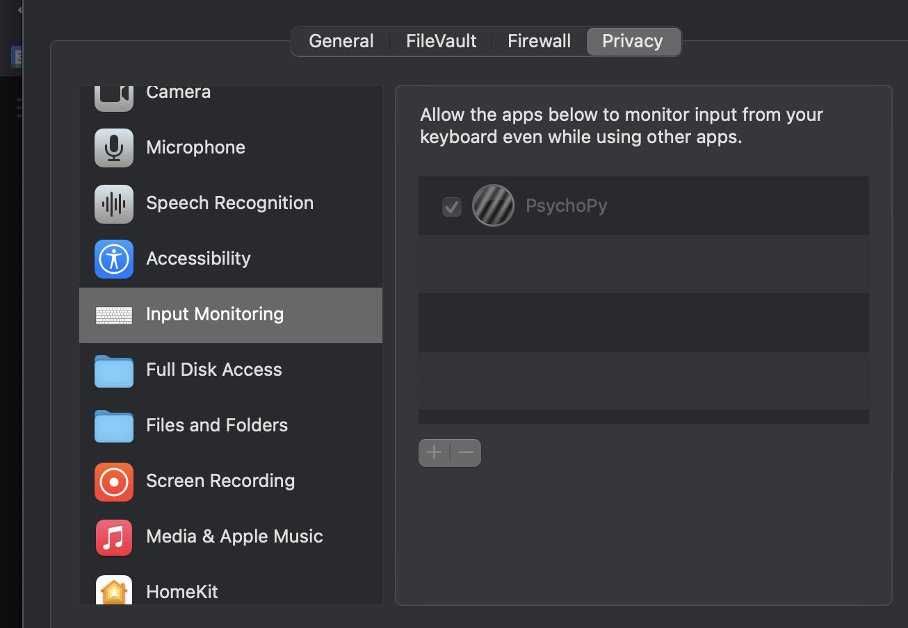

# Using PsychoPy

Date: January 7, 2025 5:04 PM

Tutorial

1. Download psychopy from [https://www.psychopy.org/download.html](https://www.psychopy.org/download.html) 
2. Open psychopy 
    1. if immediately crashing, try searching for your hidden folders in /Users/yourusername and delete folders called .psychopy3 .psychopy2
3. Open ‘coder’
4. Load in your file
5. press the green ‘run’ button
    1. if giving problems, try the following things:
    
    1. If on a mac, go to System Preferences → Security & Privacy → Privacy tab, then for ‘Accessibility’ and ‘Input Monitoring’, add Psychopy as an app who can access
    
    
    
    1. Install `brew install portaudio`, `brew install libsndfile`, `brew install portmidi`, `brew install liblo` and then `brew install —cask psychopy` and then `brew install pipx`
        
        `pipx install psychopy-sounddevice`, `pipx install psychopy-ptb`, `pipx install  psychopy-pyo`
        
        ended up also having to install git, gitpython, libsndfile, curl, pipx, and then trying to install psychopy from the command line instead of from the standalone since i was still getting dependency issues
        
    2. if needed to change  preferences, go to builder and click the grey ‘gear’ icon to alter settings. cannot alter settings of already-built scripts via this— this is just how you alter stuff for building scripts. 
    
If you're having issues, try building it in a virtual environment with pyhton 3.11:
    
    ```python
    brew install python@3.11
    python3.11 -m venv ~/venvs/psychopy-env
    brew link --overwrite python@3.11 --dry-run
    brew link --overwrite python@3.11
    source ~/venvs/psychopy-env/bin/activate
    (psychopy-env) pip install --upgrade pip setuptools wheel
    (psychopy-env) pip install psychopy
    
    ```
    
    