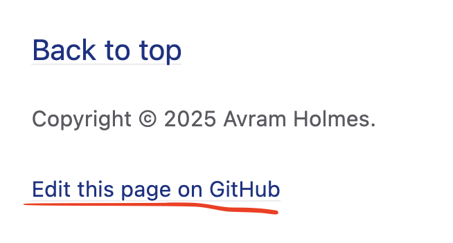
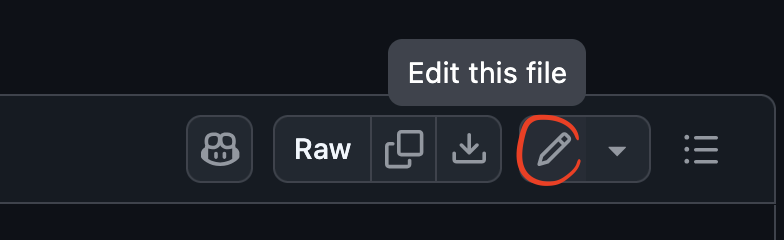
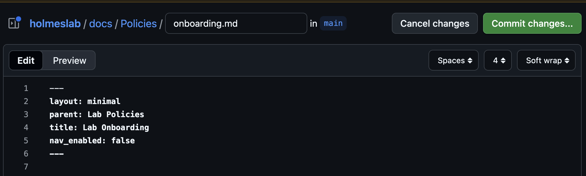
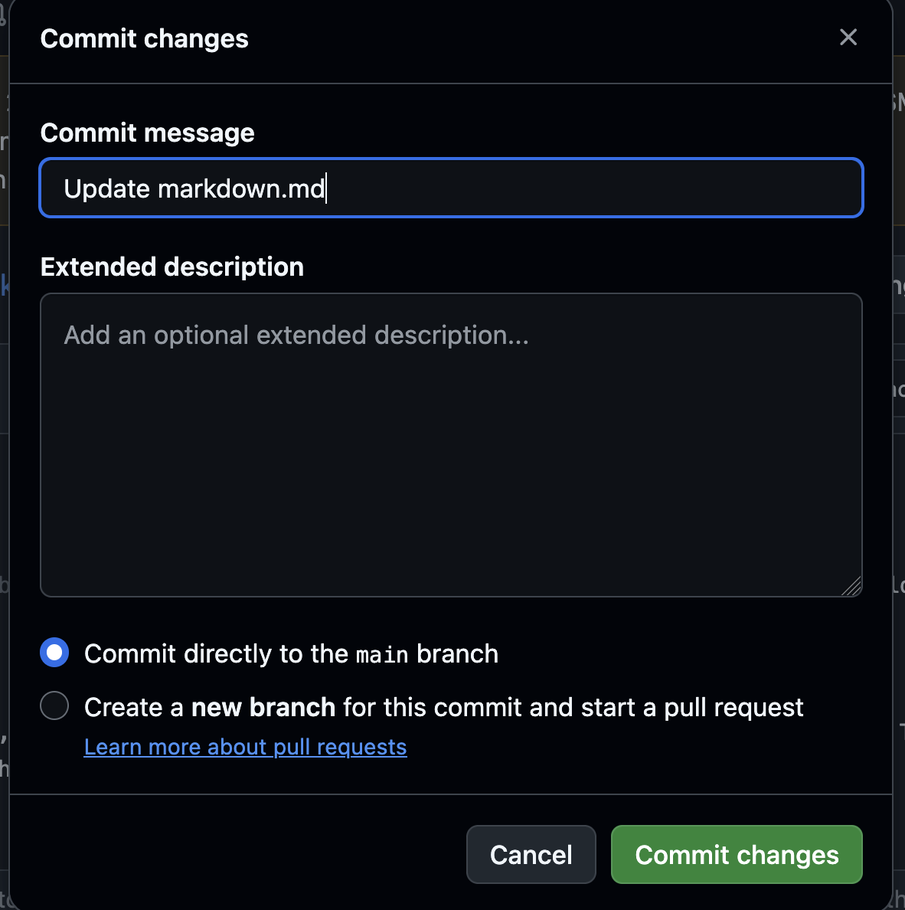

# How to update this wiki

Date Updated: Oct 2025

The lab wiki is hosted on the lab’s Github page. These steps will take you through how to update docs and the website.

There are 2 ways to update the website: 
1. Editing on the github.com website
2. Editing via a local copy on your computer and pushing the changes to github.com
    - Notion Option: Editing a page on Notion, exporting to markdown, adding that to your local copy, pushing changes (to be added)

## Editing on Github.com
1. Have a Github account
2. Get added to the lab’s github (the lab is an organization with different members)
3. Go to the page you want to edit on the wiki ([https://holmeslab.github.io/holmeslab](https://holmeslab.github.io/holmeslab))
4. Scroll to the bottom and select "Edit this page on Github"

5. On the page, select the pencil 'Edit' button

6. Edit the file by adding text and markdown style. [Find out more about markdown here](https://holmeslab.github.io/holmeslab/docs/wiki/markdown/).
7. Save your changes by pressing "Commit" button

8. Add a commit message which describes the changes you made. Commit to MAIN -- don't select 'create a new branch'


Your changes should populate to the site within 10 minutes. Usually about 2 minutes. 


## Editing a local copy 
1. Have a Github account
2. Get added to the lab’s github (the lab is an organization with different members)
3. Make sure you have git installed and your git authentication enabled
    
    Not sure? Click here to see a tutorial on getting git credentials
    
    [Github Primer](https://www.notion.so/Github-Primer-d3686c7bfac9415a9318b17f8bd82439?pvs=21)
    
4. In the terminal run
    
    `git clone https://holmeslab.github.io/holmeslab.git`
    
    1. Or, if you already have it cloned, update to the most recent version by going into the folder where you have the repository cloned and running
        
        $`git checkout main`  Make sure you’re on the correct branch
        
        $ `git pull --rebase origin main` This pulls the most updated version of the repo
        
5. Now navigate to the /docs folder
6. Open the doc you want to edit, or make a new markdown doc
    1. You can make a markdown doc by opening any code editor and creating a new text file, and saving it as .md for markdown
7. Write your doc
    1. Markdown files are written with just normal text. 
    2. Any additional formatting (headings, tables, buttons, bullet lists, etc) can be found in the 
    [markdown tutorial page][https://holmeslab.github.io/holmeslab/UsingThisWiki/UsingMarkdown].
8. Figure out what folder/file you want this file to go under
    1. All files/folders are listed in the navigation bar on the left of the website
    2. The name that appears in the navigation bar which you want it to go under will be the name you’ll put in the “parent” field below
    3. SAVE the file named something URL-appropriate, since the page online will be (for example):
    `holmeslab.github.io/holmeslab/docs/folder-title/your-file`
    - Best practice is using "-", all lowercase, as short as possible, descriptive
    - In this case, the file is in /docs/, in a folder called folder-title/, named your-file.md
9. Add this at the TOP of your markdown file
(This is because the site is a Jekyll site. Read more about page layouts on the [Jekyll Documentation](https://jekyllrb.com/docs/pages/))
```bash
---
title: your-file 
	#This is the title which will appear on the nav bar
	#This doesn't have to match any content within the file
    #This SHOULD be the name of the file-- for clarity and consistency, but nothing will break if it isn't
	#This is 
    #
nav_order: 1 
	#This is the order they'll appear in the nav bar, lowest=first
nav_enabled: true 
	#default to true
	#if false the page will still be in the nav bar,
	# but the nav bar won't be *visible* on that page
parent: folder-title
	# if this references an existing 'title' field, the doc will be 
	# located as a nested doc under that doc in the nav bar
---
```
10. If you want to make a new folder under /docs, make the folder, name it something URL-relevant formatted like `your-folder`, then within it make a file called index.md which contains the header (above), `title=your-folder`, no parent. This will be then a part of the folders shown in the nav folder to the left, and is the file which will be shown when you click on a folder itself, instead of clicking on of the subfiles within the folder. 
11. Save your markdown file into the relevant subfolderm, and make sure in the heading of your folder is a field `parent: your-folder`, otherwise it won't show up as a page within that folder.  
12. Update the file back into the github repository like this
    
    `git add your_file.md`
    
    `git commit -m "Descriptive note, for example: Adding file.md”`
    
    `git push`
    
3. Github pages may take up to 10 minutes to display the changes